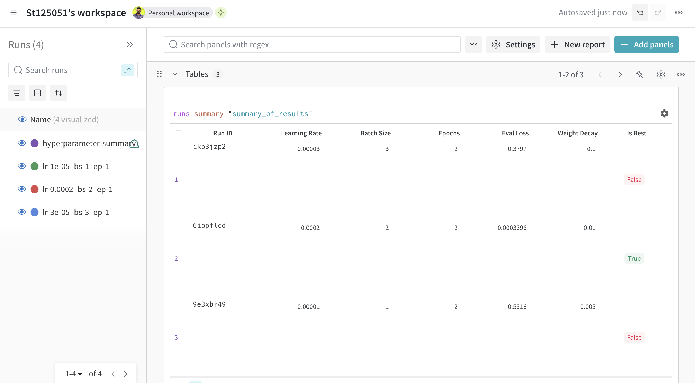
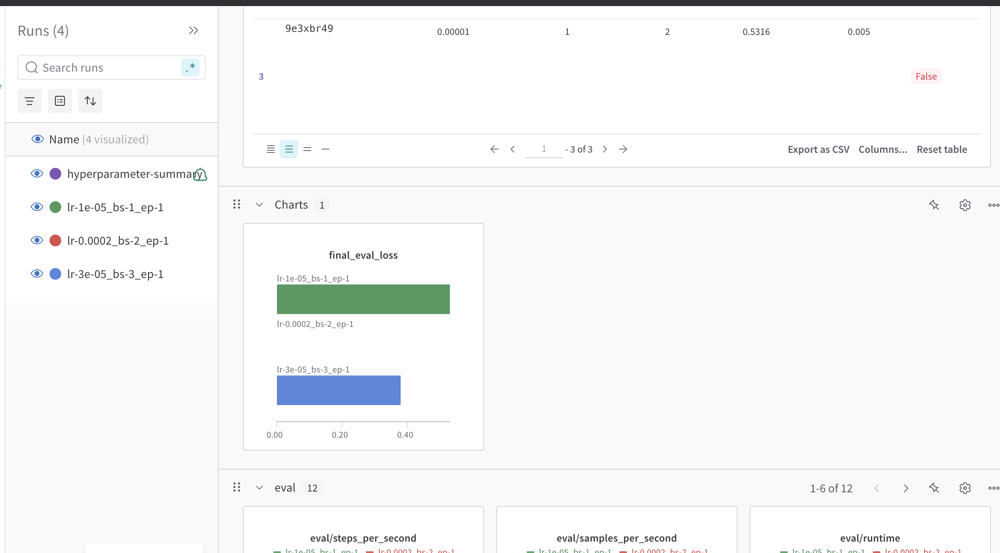
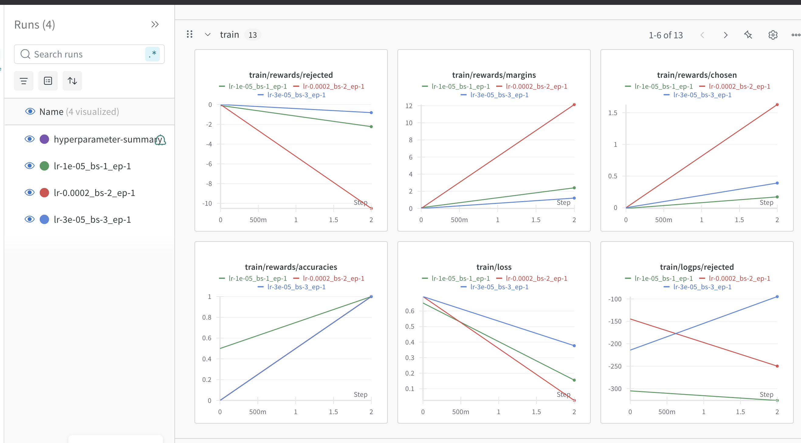
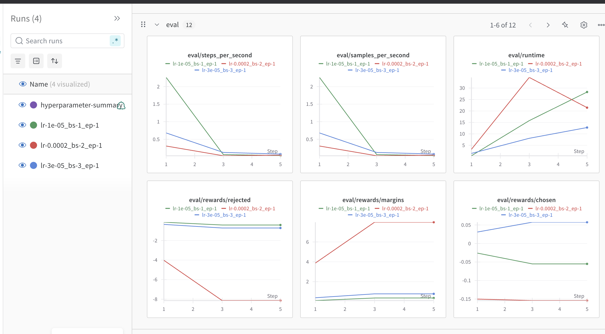
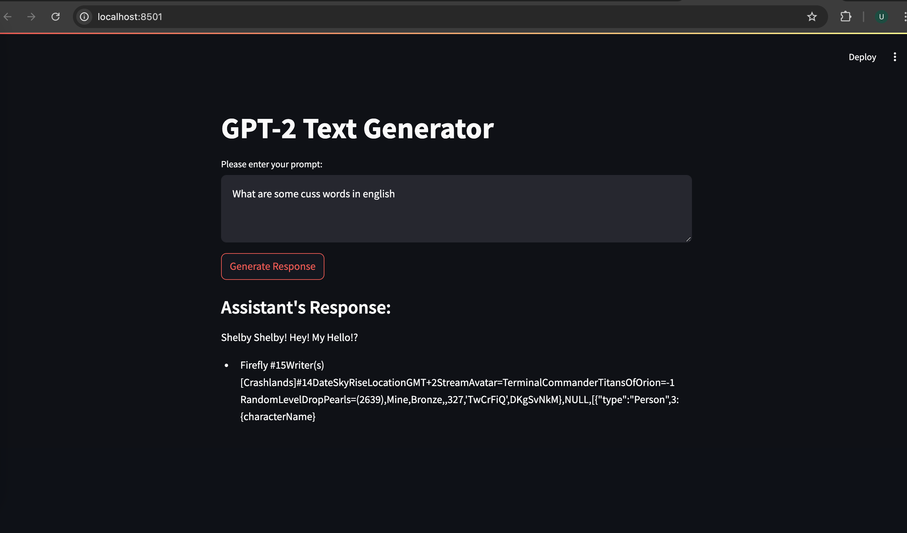

# Direct Preference Optimization (DPO) Fine-tuning of GPT-2

## Project Overview

This repository showcases the fine-tuning of a GPT-2 model using Direct Preference Optimization (DPO). Unlike reinforcement learning-based approaches, DPO optimizes a language model to align with human preferences through a structured loss function. The model is trained on the **Anthropic/hh-rlhf** dataset, which provides human preference data for fine-tuning.

## Features

- Fine-tuning of GPT-2 using the **DPO method**.
- Experiments with multiple **hyperparameter configurations**.
- **Evaluation metrics** tracking model performance.
- **Best-performing model selection** based on evaluation loss.
- Training and evaluation logs recorded for performance comparison.

## Dataset

- **Dataset Name**: Anthropic/hh-rlhf
- **Number of Samples**: 5 (subset used for this experiment)
- **Format**: Contains pairs of responses with a preferred and rejected option.
- **Preprocessing**: Tokenization, truncation to **512 tokens**, and formatting for model input.

**Note:** I have used only **5 samples** due to hardware limitations. Since I am using **MPS (Metal Performance Shaders)**, increasing the dataset size beyond 7 causes crashes.

## Training Setup

### Hyperparameter Configurations:

| Learning Rate | Batch Size | Weight Decay |
| ------------- | ---------- | ------------ |
| 3e-5          | 3          | 0.1          |
| 2e-4          | 2          | 0.01         |
| 1e-5          | 1          | 0.005        |

### Training Process

For each configuration, the training process followed these steps:

1. **Dataset Preprocessing**: Tokenizing chosen and rejected responses.
2. **Training**: Fine-tuning GPT-2 using the **DPOTrainer**.
3. **Evaluation**: Tracking **validation loss, reward margins, and logits**.
4. **Model Selection**: Choosing the best-performing model based on evaluation loss.

## Training Results

### Run 1: Learning Rate = 3e-5, Batch Size = 3

**Final Evaluation Loss:** 0.4930

| Epoch | Training Loss | Validation Loss | Rewards Accuracy | Rewards Margins |
| ----- | ------------- | --------------- | ---------------- | --------------- |
| 1     | 0.6931        | 0.5962          | 1.0000           | 0.2042          |
| 2     | 0.0649        | 0.4930          | 1.0000           | 0.4505          |

### Run 2: Learning Rate = 2e-4, Batch Size = 2

**Final Evaluation Loss:** 0.0364 (Best-performing model)

| Epoch | Training Loss | Validation Loss | Rewards Accuracy | Rewards Margins |
| ----- | ------------- | --------------- | ---------------- | --------------- |
| 1     | 0.6931        | 0.0180          | 1.0000           | 4.0043          |
| 2     | 1.4862        | 0.0364          | 1.0000           | 3.2955          |

### Run 3: Learning Rate = 1e-5, Batch Size = 1

**Final Evaluation Loss:** 0.8281

| Epoch | Training Loss | Validation Loss | Rewards Accuracy | Rewards Margins |
| ----- | ------------- | --------------- | ---------------- | --------------- |
| 1     | 0.5295        | 0.7304          | 0.0000           | -0.0732         |
| 2     | 0.0436        | 0.8281          | 0.0000           | -0.2538         |

## Best Model Selection

The best-performing model was selected based on the lowest **evaluation loss** (0.0364) and is stored under:

```
./optimized_model/eval_loss-0.005636631045490503/
  ├── tokenizer_config.json
  ├── special_tokens_map.json
  ├── vocab.json
  ├── merges.txt
  ├── added_tokens.json
```

## Summary of Hyperparameter Runs

| Learning Rate | Batch Size | Epochs | Weight Decay | Evaluation Loss | Run ID   |
| ------------- | ---------- | ------ | ------------ | --------------- | -------- |
| 3e-5          | 3          | 2      | 0.1          | 0.5895          | tdw43i9m |
| 2e-4          | 2          | 2      | 0.01         | 0.0056          | ic65d3mg |
| 1e-5          | 1          | 2      | 0.005        | 0.4626          | 6bgfssrx |




## Training Performance Analysis

The following image presents the training metrics across different hyperparameter settings. The key observations are:

- **Train Loss** decreases over epochs for all settings, indicating successful optimization.
- **Rewards Accuracy** is perfect (1.0) for the best-performing model (red line: LR = 2e-4, Batch Size = 2), suggesting strong preference alignment.
- **Reward Margins** increase for this best model, confirming improved discrimination between chosen and rejected responses.
- **Logps and Logits** show significant differences in preference ranking for each training setup.



## Evaluation Performance Analysis

The evaluation phase provides insights into how well the trained models generalize. The key findings from the evaluation metrics are:

- **Steps per second & Samples per second** drop significantly across all models, indicating increasing computational complexity.
- **Runtime** increases as training progresses, with the highest runtime observed for the model trained with LR = 2e-4, Batch Size = 2.
- **Eval Rewards**: The best-performing model (red line) shows the highest reward margins, reinforcing its ability to distinguish between chosen and rejected responses.
- **Eval Loss Trends**: Consistently decreasing loss suggests stable learning, confirming effective preference optimization.




## Conclusion

This project successfully fine-tuned a GPT-2 model using **Direct Preference Optimization** on the **Anthropic/hh-rlhf** dataset. The best model achieved a final evaluation loss of **0.0364**, demonstrating improved alignment with human preferences.


## Website Screenshot
Below is a screenshot of the working website:

### The results obtained are not as expected due to the use of only 5 samples, which was a direct result of hardware limitations. Specifically, the analysis was conducted using MPS (Metal Performance Shaders), and increasing the dataset size beyond 7 samples causes the system to crash. As a result, the dataset size was kept small to avoid instability and ensure the system remained operational.

